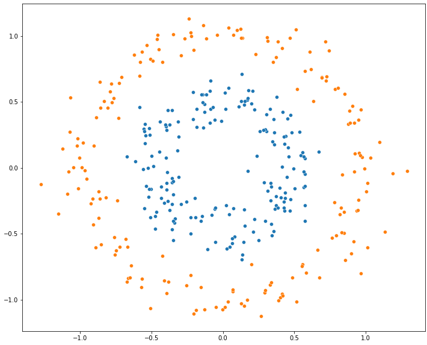
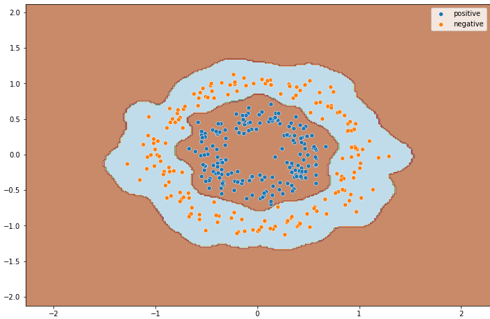

# SVM_radial_basis_func_KERNEL
In machine learning, the radial basis function kernel, or RBF kernel, is a popular kernel function used in various kernelized learning algorithms. In particular, it is commonly used in support vector machine classification.

Created a Non-Linear dataset of binary classification:

Applied "radial basis function" kernel for optimal decision line using dimentional transformation:

